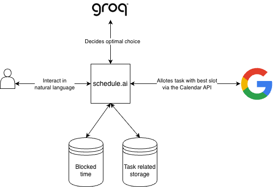

# Schedule.ai

An AI-powered task scheduler that is directly linked to your Google Calendar using Groq API.

## Design

### Must-haves

- Takes user's blocked time/non-negotiable time (like classes, office hours, sleep, etc.)

- Takes user input of task details.

- Groq works on the input and converts the natural language into a json object for the program.

- Uses Google Calendar API connected via OAuth to fetch free slots and place user's task into a matching slot.

### LLM Considerations

- Should check user's blocked times and decide best day and time and reasoning for the choice (helpful for debugging purposes).

- By using Groq to just make decisions and let the software handle slot and scheduling keeps token usage minimal.

### Data-related considerations

- Task data upto the previous week can be stored on client-side. This is simpler, since this is intended for personal use, and so users do not have to set up a SQL database for running this.

- Moreover, the json file containing the task information will take up 1KB per task, and assuming that a user creates a maximum of 10000 tasks in a month, the json will take up 10MB of file size which is a very small amount.

- Another smaller json data store will be needed to store user's blocked time like work/office hours, classes, sleep, etc.

### System Architecture

